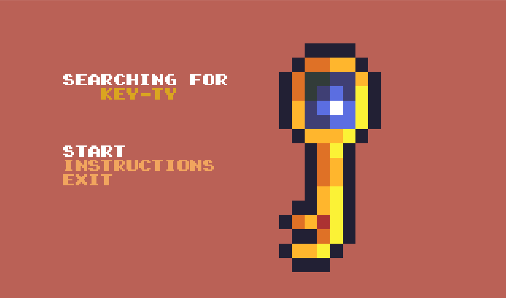
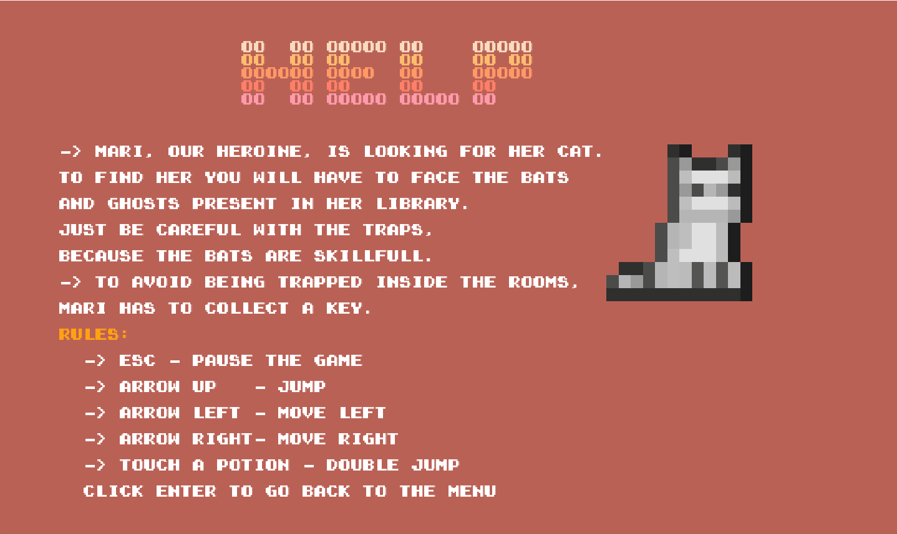
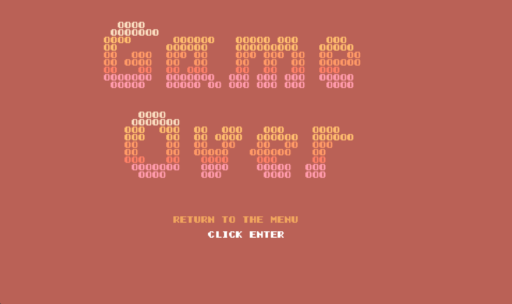
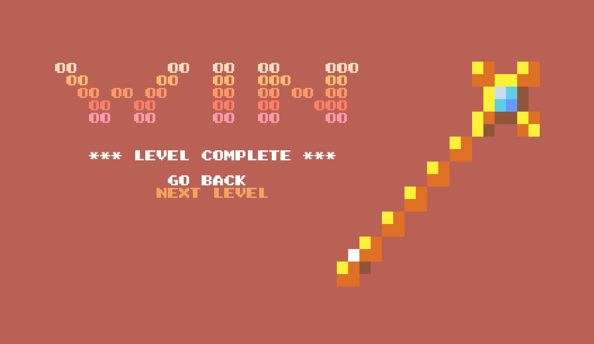
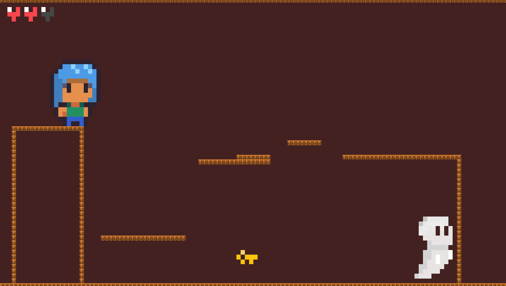
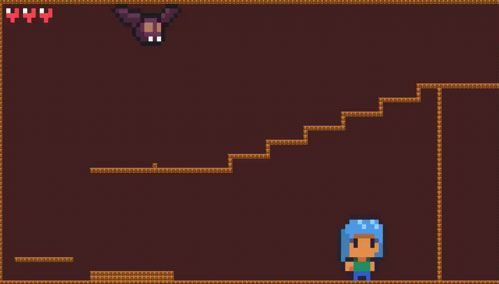
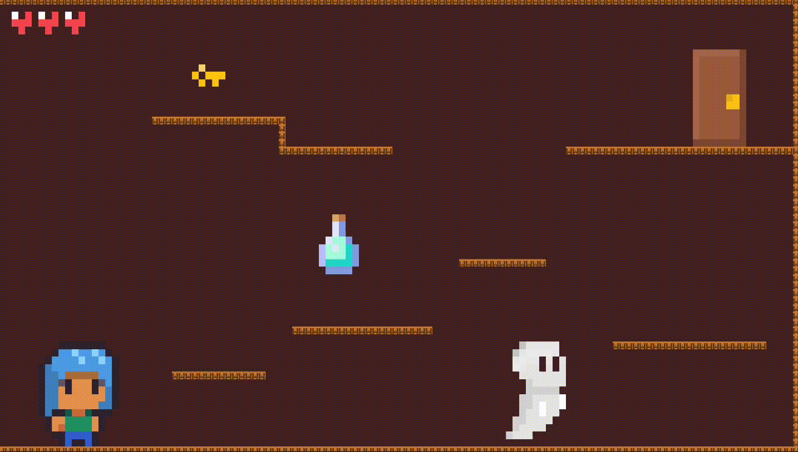

# PROJECT_L04GR08: Searching for Key-ty
Welcome to “Searching for Key-ty”, a game centered around the kidnapping of our protagonist cat. Embark on this amazing journey where Mari has to find her beloved kitten, finding the keys and moving through several rooms in a haunted mansion while trying to survive the monsters in her way.

This project for LDTS in 2022/2023 was developed by Teresa Mascarenhas (up202206828@fe.up.pt) and Sofia Gonçalves (up202205020@fe.up.pt).

## FEATURES
- [x] Moving right and left

- [x] Jumping

- [x] Potions and Double jumping

- [x] Menu

- [x] Instruction Menu

- [x] Pause Menu

- [x] Enemies

- [x] Ghosts

- [x] Bats and traps

- [x] Character lives

- [x] Game Over Menu

- [x] Collecting the key

- [x] Win Menu

- [x] Platforms

- [x] Camera

- [x] Three levels

- [x] Original designs

## SCREENSHOTS
### Menus
**Initial Menu**

**Instructions**

**Game Over**

**Game win**

### Game preview

**Level 1**

**Level 2**

**Level 3**

**Potion Effect**

