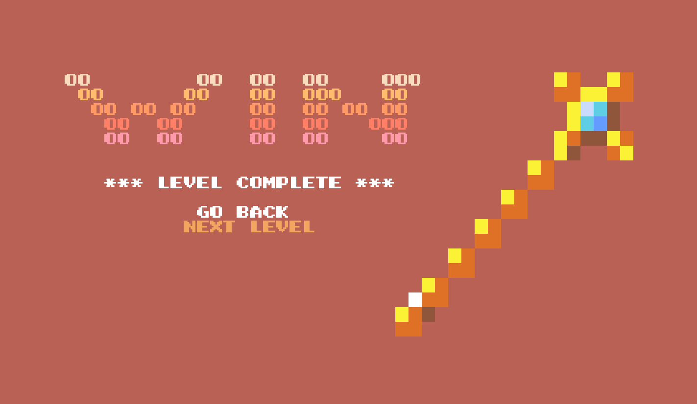
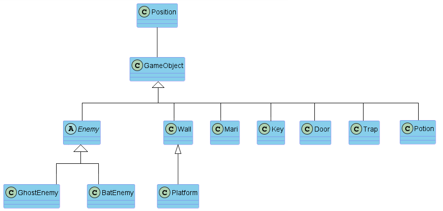

# LDTS_0408 - SEARCHING FOR KEY-TY
Welcome to “Searching for Key-ty”, a game centered around the kidnapping of our protagonist cat. Embark on this amazing journey where Mari has to find her beloved kitten, finding the keys and moving through several rooms in a haunted mansion while trying to survive the monsters in her way.

This project for LDTS in 2022/2023 was developed by Teresa Mascarenhas and Sofia Gonçalves.

## PLANNED AND IMPLEMENTED FEATURES

**- Moving right and left**: The character moves to the right when the right arrow key is pressed and to the left when the left arrow key is pressed

**- Jumping**: The character jumps when the up arrow key is pressed. The last direction she moved towards (right or left) is the direction she will jump to, or by default to the right.

**- Potions and Double jumping**: The character can jump twice in a row if it takes a potion that appears randomly on the map.

**- Menu**: The initial menu that offers options to start or exit the game, as well as access the instructions.

**- Instruction Menu**: An informational menu that provides details on the basic controls and how to play the game.

**- Pause Menu**: A menu accessible during the game that allows the players to temporarily pause it and resume the gameplay when they want.

**- Enemies**: The enemies will have different strategies to try to kill the character.

**- Ghosts**: The ghosts will randomly move left or right.

**- Bats and traps**: When the character steps on a trap, a bat will quickly come down to where the trap is.

**- Character lives**: If the character is touched by an enemy, she loses a life and remains in the game. She has 3 lives for level.

**- Game Over Menu**: When all her lives are lost, the Game Over screen appears and the player has to return to the initial menu. They can play again, but from the beginning at level 1.

**- Collecting the key**: If the character collects the key of the level, when she comes near the door the level is won and it goes to the Win screen.

**- Win Menu**: After a level is completed, the player can decide whether to play the next one or exit.

**- Platforms**: Structures where the character can jump on top of that are constantly moving up and down.

**- Camera**: When the character reaches a certain position to the right of the screen, the map shifts. A different section of the map is shown and she can´t go back.

**- Three levels**: There are three levels that are played consecutively.

**- Original designs**: Mari, the enemies and the drawings presented throughout the game were drawn by us.

## SCREENSHOTS 

<b><i>Fig 1. Main menu</i></b>

<b><i>Fig 2. Instructions menu</i></b>

<b><i>Fig 3. Game over screen</i></b>

<b><i>Fig 4. Win screen</i></b>

<b><i>Fig 5. Level 2 screenshot </i></b>

## DESIGN PROBLEMS

### An organized design structure was needed for the gameplay
**Problem**:
The absence of a structured design led to a long and confusing code for each class representing game objects. Managing different aspects of these elements was challenging without an organized structure and it was difficult to navigate through the code.

**Pattern**:
We used the design pattern MVC (Model-View-Controller) to handle this problem. This architectural pattern divides the design of our game into three interconnected components:
- Model - represents the data structure, managing the game’s data, logic and rules.
- View - is the visual representation. It displays the data, observing the model for changes and updating accordingly.
- Controller - handles input and updates the model, acting as an intermediary between the stored data in the model and the visualization of it in the view.

**Implementation**:

<b><i>Fig 6. Model, Controller and Viewer pattern design</i></b>

**Consequences**:
The adoption of the MVC Design Pattern brings several advantages:
- Organization: The overall structure is more organized and is promoting efficient development.
- Separation of responsibilities: Builds a clear separation between the game's data, visual presentation and control flow, making the code more modular and maintainable.
- Scalability: With these distinct components, it becomes easier to scale and extend the game without causing effects across the entire codebase.
- Reusability: Allows the reuse of individual components.
- Testability: Each component (model, view, controller) can be tested independently, facilitating unit testing and ensuring toughness.

-------------------------------------------------------------
### A sequence of events is constantly getting updated
**Problem**:
In our beginning game's structure, the absence of a centralized game loop disturbs the organized management of critical functions. Our design lacked this unified system, which results in scattered rendering logic and distributed event management responsibilities across the codebase.

**Pattern**:
To face this challenge, we implemented the Game Loop Pattern. This loop efficiently manages event processing, rendering updates and other crucial game functions, arranging a sequence of events in a simplified way.

**Implementation**:

<b><i>Fig 7. Game loop pattern design</i></b>

**Consequences**:
Introducing a structured game loop owns impressive advantages:
- Systematic updating: The dedicated loop ensures systematic updates for rendering and event processing, minimizing scattered logic and improving overall performance.
- Organization: The loop fosters a structured codebase, simplifying comprehension and facilitating more effective modification of specific game phases.
- Streamlined game flow: With an organized loop, game events flow more smoothly, enhancing user experience and enabling easier expansion or updates to the game.

-------------------------------------------------------------
### What appears on the terminal differs depending on the game state
**Problem**:
In our current terminal-based game, our idea was to have different information displayed on the screen based on where the game is at (menu, instructions, gameplay,...) and the management of the game states lacked a centralized structure. This results in scattered logic and dispersed responsibility throughout the code.

**Pattern**:
We've used the State Pattern to represent various game states as separate classes, each containing specific behavior. This approach enables smooth transitions between states by switching to their respective implementations.

**Implementation**:

<b><i>Fig 8. State pattern design</i></b>

**Consequences**:
- Defined state representation: Game states are now distinct classes, replacing scattered logic for a clear structure.
- Efficient transitions of state: Using the State Pattern simplifies switching between states, enhancing the code readability.
- Organized state management: Despite more classes, the structured design ensures maintainability and scalability.

-------------------------------------------------------------
### Multiple classes for objects in the game with the same functions, but different implementations
**Problem**:
In the beginning of this project, we thought about how we had to organize various game elements in classes that shared similar functions, but where their implementations diverge. The creation of a different class for every object results in a code characterized by redundancy and repeated code.

**Pattern**:
We decided to use the Factory Method Pattern, where a base class (GameObject) is the foundation for all the game objects, such as mari, enemies and walls. Each specific element type now extends this class, implementing the pattern to create instances of it. That promotes code reuse and encapsulates shared functionalities.

**Implementation**:

<b><i>Fig 9. Factory method pattern design</i></b>

**Consequences**:
- Encapsulation:  By encapsulating the object creation process in a separate method, it allows the subclasses to provide their own implementations and variations while maintaining the rest of the code.
- Consistent Creation: This pattern ensures a unified and consistent approach for creating diverse game objects, by enabling many classes to share a common interface.
- Extensibility: Adding new elements to the game becomes easier and straightforward, as they adhere to the common creation interface. A centralized creation logic simplifies additions without modifying the existing code.

-------------------------------------------------------------
### Enemies should have different strategies to attack the main character
**Problem**:
The game faced issues with disorganized enemy behavior management. The code lacked structure, resulting in tangled logic that made it hard to maintain and grow the game. Different enemy behaviors were entangled, lacking clear distinctions between enemy types and their attack strategies, causing a lack of code organization.

**Pattern**:
To address this issue, we implemented the Strategy Pattern for enemy behavior. This pattern allowed us to create distinct classes for each enemy type, such as GhostEnemy and BatEnemy, encapsulating their unique attack strategies. Through this pattern, we achieved modular and interchangeable enemy behaviors.

**Implementation**:

<b><i>Fig 10. Strategy pattern design</i></b>

**Consequences**:
- Encapsulation: Utilizing the Strategy Pattern optimized enemy behavior management. Each enemy type now encapsulates its attack strategy, reducing convoluted logic and enhancing code organization.
- Dynamic enemy variation: Distinct classes for each enemy type enable effortless switching of attack strategies mid-game, diversifying enemy behaviors without complicating the game's structure.
- Modularity: By isolating enemy behaviors into separate classes, our codebase gained modularity, improving readability, scalability and supporting future expansions.

-------------------------------------------------------------
### The bat enemy should attack if the character passes through a certain place
**Problem**:
In our game, a specific enemy (Bat) should be triggered to attack based on a specific event, in this case, the character passing through a particular place on the map where a trap is.

**Pattern**:
For this problem, we implemented the Observer Pattern. This pattern allows a subject to notify its observers about any state changes. In this context, the trap is the subject and the bat enemies are the observers waiting for the signal to attack, and each bat is associated to a trap.
When the character passes through the trap, it triggers a change on it. The enemies, acting as observers, receive this notification and initiate their attack based on that updated state.
This approach provides a flexible solution, as the character's movement and the enemies' reactions are independent.

**Implementation**:

<b><i>Fig 11. Observer pattern design</i></b>

**Consequences**:
- Decoupling: The Observer Pattern promotes a loose coupling between the subject and the observers, allowing them to interact without having detailed knowledge of each other.
- Scalability: It also facilitates the addition of new observers without modifying the subject, making the system more scalable and adaptable to some changing requirements.
- Event Handling: Effectively handles relationships one to many, where a single event can notify multiple observers.

-------------------------------------------------------------
### Implementation - UML

<b><i>Fig 12. UML</i></b>

## ERROR-PRONE WARNINGS
- On the testStateStep method of StateTest, there is 2 warnings about unchecked conversion.

..\src\test\java\com\st\projectst\states\StateTest.java:110:

warning: [unchecked] unchecked conversion -> return mockController; required: Controller<Object>, found:    Controller

warning: [unchecked] unchecked conversion -> return mockViewer;  required: Viewer<Object>, found: Viewer

**Justification**: When attempting different approaches or modifications to this test method, the PITest coverage may reduce due to the following reason:
 - **Complexity of State Simulation**: Altering the test method might lead to a reduced coverage because of the intricate nature of simulating state transitions accurately. 
The current setup ensures a comprehensive testing of state handling under various conditions, thus contributing significantly to the overall coverage metrics.

## KNOWN CODE SMELLS
- **Long classes**: Some of the classes are very long since they have several methods and/or attributes, like for example LanternaGUI or Mari. These classes can be harder to maintain and to read.

- **Tests that open windows**: There are tests on the menu controller and GUI that open terminal windows. We didn't include them on the pitest testing.

## TESTING
### Coverage

<b><i>Fig 13. Code coverage screenshot</i></b>

### Pitest
In order to consult the report, click [here](pitest/index.html).

<b><i>Fig 14. Pit Test coverage screenshot</i></b>

## SELF-EVALUATION
The tasks were distributed equally and everyone contributed to the development of the project.
- Teresa Mascarenhas: 50%
- Sofia Gonçalves: 50%
